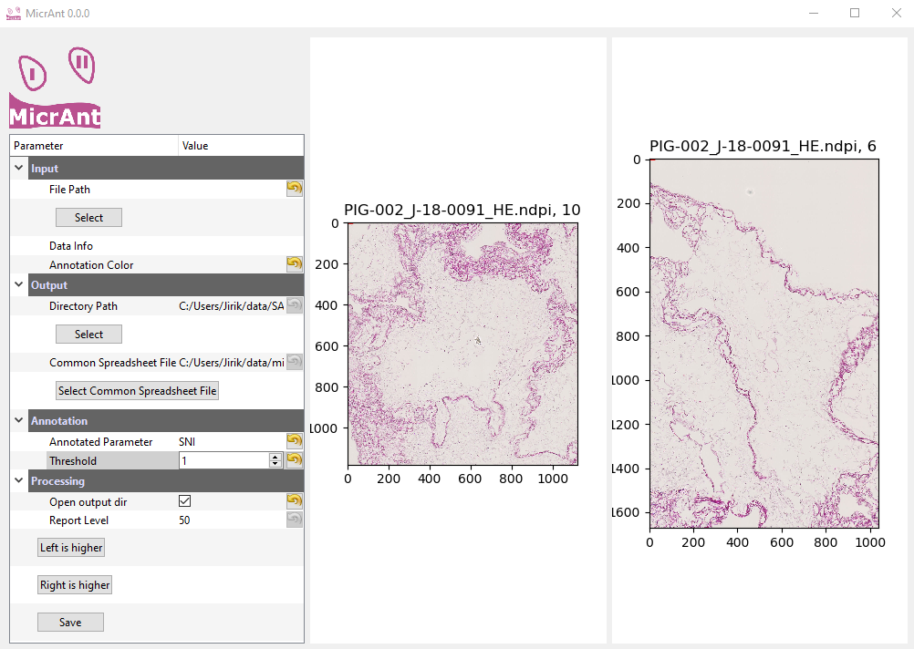

  
[](https://travis-ci.org/mjirik/micrant)
[](https://coveralls.io/github/mjirik/micrant?branch=master)
[](http://badge.fury.io/py/micrant)


# Micrant

Annotation of microscopic data for image processing by comparing two images.





# Install

You can use [anaconda distribution](https://docs.conda.io/en/latest/miniconda.html)
for easy installation 

```bash
conda install -c mjirik -c conda-forge -c bioconda scaffan python=3.6 pytest
```

## Get sample data and test

Download sample images to ~/data

```bash
python -m io3d.datasets -v -l CMU-1 CMU-1-annotation SCP003
python -m pytest tests/
```


